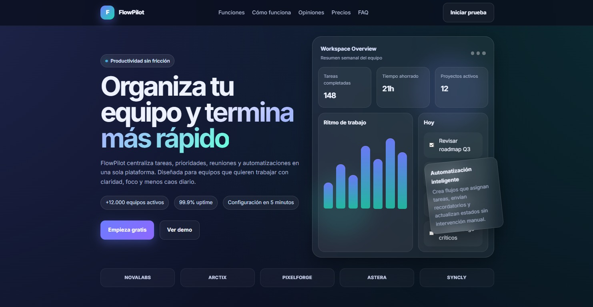

# FlowPilot – SaaS Landing Page

Landing page moderna para una aplicación ficticia de productividad llamada **FlowPilot**.  
Este proyecto fue creado como parte de mi portafolio para demostrar habilidades en desarrollo front-end y diseño de interfaces.

## 🚀 Demo

Puedes ver el proyecto aquí:

[https://iisaiias.github.io/flowpilot-landing/](https://iisaiias.github.io/flowpilot-landing/)

## 🧠 Descripción

FlowPilot es una landing page que simula el sitio de una herramienta SaaS para gestión de equipos y tareas.  
El objetivo del proyecto fue construir una página visualmente atractiva, responsive y con microinteracciones.

## ✨ Características

- Diseño moderno estilo SaaS
- Layout completamente responsive
- Animaciones al hacer scroll
- Menú de navegación adaptable a móvil
- Sección de precios
- FAQ interactivo
- Componentes reutilizables
- Dashboard visual simulado en el hero

## 🛠️ Tecnologías utilizadas

- HTML5
- CSS3
- JavaScript
- Flexbox / Grid
- Intersection Observer API

## 📁 Estructura del proyecto

flowpilot-landing
│
├── index.html
├── css
│ └── style.css
├── js
│ └── script.js

## 🎯 Objetivo del proyecto

Este proyecto forma parte de una serie de proyectos de portafolio:

1. Landing page moderna (este proyecto)
2. Sitio web para negocio
3. Dashboard administrativo

## 📸 Preview

## 👨‍💻 Autor

Isaias  
Desarrollador Frontend

GitHub:
https://github.com/iisaiias/
